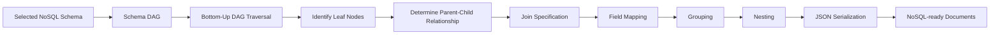

# 🚀 SchemaScence — Query-Aware Optimization for RDB-to-NoSQL Transformation

<p align="center">

**An intelligent, workload-aware framework for selecting, evaluating, visualizing, and migrating relational database schemas to NoSQL document models.**

<br>


</p>

---

## 📌 Overview

**SchemaScence** is a query-aware database schema optimization and migration framework designed to address one of the major challenges in **Relational Database (RDB) → NoSQL document database migration**:

> **How do we choose the best NoSQL schema for the application's actual query workload instead of relying only on manual database-design intuition?**

Traditional RDB-to-NoSQL migration approaches can produce multiple possible document schemas, and there may be no obvious way to determine which schema is best for a particular application's access patterns.

SchemaScence addresses this problem by combining:

* 🧩 **DAG-based schema representation**
* 🔎 **Query-aware workload analysis**
* 📊 **QBMetrics-based schema evaluation**
* 🏆 **Scenario-based schema ranking**
* 📈 **Interactive Streamlit visualization**
* 🔄 **Python-based data transformation**
* 🗂️ **NoSQL document generation**
* 🧪 **DVD Store benchmark evaluation**

The system converts both **candidate NoSQL schemas** and **SQL query workloads** into Directed Acyclic Graphs (DAGs), calculates structural/query coverage metrics, ranks competing schemas under different workload scenarios, and provides a migration planner for the selected schema.

The project is based on the **QBMetrics and Metamorfose methodologies**, while extending the evaluation process with an interactive dashboard and a DVD Store workload.

---

# 🎯 Problem Statement

Migrating a relational database to a NoSQL document database is not simply a table-to-JSON conversion problem.

A relational database is typically organized around:

```text
Tables
   ↓
Primary Keys
   ↓
Foreign Keys
   ↓
Relationships
   ↓
JOIN-based Queries
```

Whereas a document database is organized around:

```text
Collections
   ↓
Documents
   ↓
Embedded Documents
   ↓
Nested Arrays
   ↓
Application Access Patterns
```

A relational schema can therefore be transformed into **multiple valid NoSQL schemas**, each with different query-access characteristics.

The central optimization problem can be represented as:

```text
              Application Workload
                       │
                       ▼
                 SQL Queries
                       │
                       ▼
                Query Analysis
                       │
                       ▼
              Candidate NoSQL Schemas
                       │
                       ▼
                  DAG Modeling
                       │
                       ▼
             QBMetrics Evaluation
                       │
                       ▼
              Scenario-based Ranking
                       │
                       ▼
             Best-fit NoSQL Schema
                       │
                       ▼
             Migration & Transformation
                       │
                       ▼
              NoSQL-ready Documents
```

The project specifically addresses the cognitive burden of manually interpreting graph-based schema metrics and the limitation of evaluating migration strategies only on narrow workloads.

---

# 💡 Key Idea

Instead of asking:

> "Which NoSQL schema looks better?"

SchemaScence asks:

> **"Which NoSQL schema provides the best structural and query coverage for this application's workload?"**

This changes schema selection from a largely intuition-driven process into a **measurable, explainable, workload-aware decision process**.

---


---

# 🔄 Complete Workflow

The complete pipeline consists of four major stages:

```text
┌──────────────────────────────────────────────────────────┐
│                  SCHEMA & WORKLOAD INPUT                  │
│                                                          │
│  Relational Schema + SQL Query Workload                 │
└───────────────────────────┬──────────────────────────────┘
                            │
                            ▼
┌──────────────────────────────────────────────────────────┐
│                 1. DAG REPRESENTATION                    │
│                                                          │
│  RDB Schema ──────────────► Schema DAGs                  │
│  SQL Queries ─────────────► Query DAGs                   │
└───────────────────────────┬──────────────────────────────┘
                            │
                            ▼
┌──────────────────────────────────────────────────────────┐
│                 2. QBMETRICS EVALUATION                  │
│                                                          │
│  Path │ SubPath │ IndPath │ DirEdge │ AllEdge            │
│  ReqColls │ FArray                                       │
└───────────────────────────┬──────────────────────────────┘
                            │
                            ▼
┌──────────────────────────────────────────────────────────┐
│                3. SCENARIO-BASED RANKING                 │
│                                                          │
│  Scenario 1 → Minimum Collections                       │
│  Scenario 2 → Best Access-Pattern Match                │
│  Scenario 3 → Preferred Query Workload                  │
└───────────────────────────┬──────────────────────────────┘
                            │
                            ▼
┌──────────────────────────────────────────────────────────┐
│                  4. DATA MIGRATION                       │
│                                                          │
│  Selected DAG → Bottom-up Traversal → Joins             │
│  → Field Mapping → Nesting → JSON Documents             │
└──────────────────────────────────────────────────────────┘
```

---

# 🧠 1. DAG-Based Schema Representation

SchemaScence represents NoSQL document schemas using **Directed Acyclic Graphs (DAGs)**.

A DAG is represented as:

```text
G = (V, E)
```

Where:

* `V` = vertices/entities
* `E` = relationships between entities

Each vertex represents a relational table and stores information such as:

* Table name
* Attributes
* Primary key

Edges represent relationships and contain information such as:

* Primary keys
* Foreign keys
* Cardinality
* Relationship direction

The root vertex represents the main document/collection, while child vertices represent nested entities.

### Relationship Mapping

```text
1 : 1  ─────────► Embedded Document

N : 1  ─────────► Embedded Document

1 : N  ─────────► Array of Embedded Documents
```

This allows relational structures to be converted into hierarchical document-oriented representations.

---

# 🔎 2. SQL Query → Query DAG

Application queries are also represented as DAGs.

The system considers read queries expressed using:

```sql
SELECT ... 
FROM ...
WHERE ...
```

with support for:

* `INNER JOIN`
* `LEFT JOIN`
* `RIGHT JOIN`

More complex constructs such as subqueries, unions, and aggregations are outside the scope of the reported implementation.

### Query DAG Rules

#### Single-table query

```text
Customers
```

becomes:

```text
Customers
   ●
```

#### LEFT JOIN

```sql
Customers
LEFT JOIN Orders
ON Customers.id = Orders.customer_id
```

becomes:

```text
Customers
    │
    ▼
 Orders
```

#### RIGHT JOIN

The rightmost table becomes the root.

#### INNER JOIN

The first table in the `FROM` clause becomes the root.

These rules provide a consistent transformation from SQL access patterns to hierarchical DAG structures.

---

# 📊 3. Query-Based Metrics

SchemaScence evaluates how effectively a candidate NoSQL schema supports the application's query workload.

The framework implements the following metrics:

| Metric       | Purpose                                                       |
| ------------ | ------------------------------------------------------------- |
| **Path**     | Measures exact query-path coverage                            |
| **SubPath**  | Detects contiguous query paths inside schema paths            |
| **IndPath**  | Detects query paths appearing indirectly                      |
| **DirEdge**  | Measures edge coverage while preserving direction             |
| **AllEdge**  | Measures edge coverage regardless of direction                |
| **ReqColls** | Measures the number of collections required to answer a query |
| **FArray**   | Identifies predicates located inside embedded arrays          |

These metrics quantify the correspondence between query DAGs and schema DAGs.

---

# 🧮 4. Schema Scoring

Individual query-level metrics are aggregated into schema-level scores.

The framework uses:

```text
QScore
   ↓
Query-level evaluation
   ↓
Weighted aggregation
   ↓
SScore
   ↓
Schema-level ranking
```

Query weights allow the system to model real-world workloads where some queries are executed more frequently or are more important than others.

This means the same set of candidate schemas can produce different rankings under different application priorities.

---

# 🏆 5. Scenario-Based Schema Selection

One of the most important features of SchemaScence is **scenario-based ranking**.

Instead of assuming that one schema is universally optimal, the system evaluates candidate schemas under different objectives.

## Scenario 1 — Minimum Collection Access

### Objective

Minimize the number of collections required to answer the workload.

```text
Goal:
Fewer collections
       ↓
Less cross-collection access
       ↓
Simpler application queries
```

Ranking:

```text
🥇 SC
🥈 SB
🥉 SD
4️⃣ SA
```

SC achieved a `ReqColls` score of **1.0000**.

---

## Scenario 2 — Best Access-Pattern Match

### Objective

Maximize alignment between:

```text
Query DAG
      ↕
Schema DAG
```

The scenario emphasizes:

* Path
* DirEdge
* AllEdge

with path-related weights:

```text
Path     = 1.0
SubPath  = 0.5
IndPath  = 0.3
```

Ranking:

```text
🥇 SC — 0.61
🥈 SA — 0.47
🥉 SD — 0.26
4️⃣ SB — 0.10
```

SC provides the strongest overall access-pattern alignment in this scenario.

---

## Scenario 3 — Preferred Query Workload

This scenario demonstrates that the **importance of individual queries can change the optimal schema**.

Queries:

```text
q1, q2, q3
```

receive higher weights than the remaining workload.

Ranking:

```text
🥇 SA — 0.66
🥈 SC — 0.63
🥉 SD — 0.37
4️⃣ SB — 0.08
```

The important insight is:

> **There is no universally optimal NoSQL schema. The best schema depends on the application's workload and optimization objective.**

The reported experiments confirm that changing query weights can change the final ranking even when the underlying structural metrics remain the same.

---

# 🧪 Experimental Setup

The evaluation uses:

```text
4 Candidate NoSQL Schemas
        +
8 SQL Queries
        +
3 Evaluation Scenarios
```

### Candidate Schemas

| Schema | Description                                                             |
| ------ | ----------------------------------------------------------------------- |
| **SA** | Direct translation based primarily on RDB metadata                      |
| **SB** | E-R-based schema with alternative nesting                               |
| **SC** | E-R and table-classification based schema emphasizing fewer collections |
| **SD** | Relationship/application-oriented schema emphasizing frequent joins     |

---

# 🗃️ Query Workload

The experimental workload contains eight read queries:

```text
q1 → Customers
q2 → Products + Inventory
q3 → Orders + OrderLines
q4 → Customers → Orders → OrderLines → Products
q5 → Products → OrderLines → Orders → Customers
q6 → Orders + Customers + OrderLines
q7 → Inventory + OrderLines
q8 → OrderLines
```

The workload covers:

* Single-table queries
* Inner joins
* Left joins
* Right joins
* Multi-level joins
* Nested access patterns

This gives the framework a more diverse workload than simply evaluating basic CRUD operations.

---


# 🖥️ Interactive Dashboard

SchemaScence provides a Streamlit-based dashboard that transforms the underlying metric calculations into an interactive analysis environment.

The dashboard contains the following major modules:

```text
┌──────────────────────────┐
│       Dashboard          │
├──────────────────────────┤
│  📋 Overview             │
│  📊 Metrics Explorer     │
│  🏆 Scenario Ranking     │
│  🔗 DAG Visualizer       │
│  🔄 Migration Planner    │
│  📤 Export               │
└──────────────────────────┘
```

The dashboard allows users to inspect candidate schemas, understand their collection structures, explore metrics, configure scenarios, compare rankings, and proceed toward migration.

---

# 📋 Dashboard Modules

## 1. Overview

Displays:

* Candidate schemas
* Collections
* Entity structures
* Schema organization

Supported candidate schemas:

```text
SA
SB
SC
SD
```

---

## 2. Metrics Explorer

Provides visibility into:

```text
Path
SubPath
IndPath
DirEdge
AllEdge
ReqColls
FArray
```

This makes the schema-ranking process more transparent by showing **why** a schema performs better or worse.

---

## 3. Scenario Ranking

Displays final schema rankings for:

```text
Scenario 1 → Minimum Collections
Scenario 2 → Access-Pattern Matching
Scenario 3 → Preferred Queries
```

This allows users to see how application priorities influence schema selection.

---

## 4. DAG Visualizer

Provides graphical representations of:

```text
Entities
   ↓
Relationships
   ↓
Nested Structures
   ↓
Document Collections
```

The root entity represents the main document structure, while connected entities represent nested structures.

---

## 5. Migration Planner

After selecting the best schema, the migration planner converts the selected DAG structure into executable transformation logic.

Pipeline:

```text
Selected Schema
      ↓
Schema DAG
      ↓
DAG Traversal
      ↓
Parent / Child Relationships
      ↓
Join Specification
      ↓
Field Mapping
      ↓
Grouping
      ↓
Nesting
      ↓
JSON-like Documents
```

---

## 6. Export

The dashboard can export:

* Ranking information
* Metric results
* Selected schema
* Evaluation summaries

This supports reproducibility and makes evaluation results easier to reuse during migration and reporting.

---

# 🔄 Data Migration Pipeline

Once the optimal schema is selected, SchemaScence performs schema-guided data transformation using Python.



The migration stage follows these core steps:

1. Export selected schema
2. Traverse schema DAG
3. Determine parent-child nesting order
4. Generate transformation commands
5. Perform joins
6. Apply field mappings
7. Group related records
8. Embed child entities
9. Serialize the resulting documents

The reported implementation uses Python for the transformation layer rather than the JavaScript UDF/Spark-oriented execution described in the original framework.

---

# 🧩 Example Document Transformation

### Relational Representation

```text
Orders
 ├── order_id
 ├── customer_id
 └── order_date

OrderLines
 ├── line_id
 ├── order_id
 ├── product_id
 └── quantity
```

### Target Document Representation

```json
{
  "order_id": 1001,
  "customer_id": 42,
  "order_date": "2025-03-21",
  "order_lines": [
    {
      "line_id": 1,
      "product_id": 11,
      "quantity": 2
    },
    {
      "line_id": 2,
      "product_id": 15,
      "quantity": 1
    }
  ]
}
```

This preserves the schema choice made during the evaluation stage instead of performing a blind table-to-document conversion.

---

# 🛠️ Technology Stack

| Technology                  | Role                                                  |
| --------------------------- | ----------------------------------------------------- |
| **Python**                  | Core implementation and transformation pipeline       |
| **Streamlit**               | Interactive dashboard                                 |
| **DAGs**                    | Schema and query representation                       |
| **QBMetrics**               | Query-aware schema evaluation                         |
| **Metamorfose methodology** | Conceptual foundation for RDB-to-NoSQL transformation |
| **Pandas**                  | Data manipulation in the Python execution layer       |
| **JSON**                    | NoSQL-ready document serialization                    |
| **DVD Store**               | Relational benchmark workload                         |

The project report specifically describes Python-based transformation and Streamlit dashboard integration, with pandas/Python dictionaries/direct database connectors identified as possible execution-layer approaches.

---

# 📂 Suggested Project Structure

```text
SchemaScence/
│
├── 📁 dashboard/
│   ├── app.py
│   ├── overview.py
│   ├── metrics_explorer.py
│   ├── scenario_ranking.py
│   ├── dag_visualizer.py
│   ├── migration_planner.py
│   └── export.py
│
├── 📁 core/
│   ├── schema_parser.py
│   ├── query_parser.py
│   ├── dag.py
│   ├── metrics.py
│   ├── scoring.py
│   └── ranking.py
│
├── 📁 migration/
│   ├── dag_traversal.py
│   ├── command_generator.py
│   ├── field_mapping.py
│   ├── transformer.py
│   └── exporter.py
│
├── 📁 data/
│   ├── schemas/
│   ├── queries/
│   └── dvdstore/
│
├── 📁 results/
│   ├── scenario1/
│   ├── scenario2/
│   └── scenario3/
│
├── 📁 assets/
│   ├── architecture.png
│   ├── workflow.png
│   └── dashboard.png
│
├── requirements.txt
├── README.md
└── LICENSE
```

> **Note:** The structure above is a recommended GitHub organization for the project. Rename files/directories to match your actual implementation before committing.

---

# ⚙️ Installation

## 1. Clone the Repository

```bash
git clone https://github.com/<your-username>/SchemaScence.git
cd SchemaScence
```

## 2. Create a Virtual Environment

### Windows

```bash
python -m venv venv
venv\Scripts\activate
```

### Linux / macOS

```bash
python3 -m venv venv
source venv/bin/activate
```

## 3. Install Dependencies

```bash
pip install -r requirements.txt
```

---


sequenceDiagram

    participant U as User
    participant D as Dashboard
    participant Q as Query Engine
    participant M as QBMetrics
    participant R as Ranking Engine
    participant P as Migration Planner

    U->>D: Select schemas and workload
    D->>Q: Parse SQL queries
    Q->>Q: Generate Query DAGs

    D->>M: Submit Schema DAGs + Query DAGs
    M->>M: Calculate query-based metrics
    M->>R: Generate scores

    R->>R: Apply scenario weights
    R->>D: Return schema ranking

    U->>D: Select optimal schema
    D->>P: Send selected DAG

    P->>P: Traverse DAG
    P->>P: Generate transformation commands
    P->>P: Join + map + nest data

    P->>D: Return document preview
    D->>U: Display / Export result
```

---

# ⭐ Key Features

### 🔍 Query-Aware Schema Selection

Select schemas based on actual application access patterns rather than only structural similarity.

### 🧠 DAG-Based Modeling

Represent both schemas and queries as graph structures for systematic comparison.

### 📊 Multi-Metric Evaluation

Evaluate schemas using:

```text
Path
SubPath
IndPath
DirEdge
AllEdge
ReqColls
FArray
```


# 📌 Why This Project Is Different

Traditional migration:

```text
RDB
 │
 ▼
Manual Schema Design
 │
 ▼
NoSQL
```

SchemaScence:

```text
                    ┌───────────────┐
                    │ RDB Schema    │
                    └───────┬───────┘
                            │
                            ▼
                    ┌───────────────┐
                    │ Query Workload│
                    └───────┬───────┘
                            │
                    ┌───────▼───────┐
                    │  DAG Modeling │
                    └───────┬───────┘
                            │
                    ┌───────▼───────┐
                    │   QBMetrics   │
                    └───────┬───────┘
                            │
                    ┌───────▼───────┐
                    │Scenario Ranking│
                    └───────┬───────┘
                            │
                    ┌───────▼───────┐
                    │ Best-fit Schema│
                    └───────┬───────┘
                            │
                    ┌───────▼───────┐
                    │    Migration  │
                    └───────┬───────┘
                            │
                    ┌───────▼───────┐
                    │NoSQL Documents│
                    └───────────────┘
```

The main advantage is that schema selection becomes **workload-aware, measurable, scenario-driven, and explainable**.

---

# 📊 Results at a Glance

```text
                    SCHEMA PERFORMANCE
                    ──────────────────

Scenario 1
Minimum Collections

SC ████████████████████ 1.00
SB ██████████████████   0.89
SD ███████████████      0.73
SA ███████████          0.57


Scenario 2
Best Access Pattern

SC ████████████         0.61
SA █████████            0.47
SD █████                0.26
SB ██                   0.10


Scenario 3
Preferred Queries

SA █████████████        0.66
SC █████████████        0.63
SD ███████              0.37
SB ██                   0.08
```

---

# 💭 Key Findings

### Finding 1 — No Single Schema Is Always Best

The optimal schema changes according to the application's requirements.

### Finding 2 — Query Weight Matters

Increasing the importance of specific queries can change the final ranking.

### Finding 3 — Structural Similarity Is Not Enough

A schema may have good overall edge coverage while performing poorly on exact query paths.

### Finding 4 — Fewer Collections Can Be Valuable

Scenario 1 demonstrates the importance of minimizing collection access.

### Finding 5 — Visualization Improves Interpretability

The dashboard connects graph structures and numerical metrics, making the ranking easier to understand.

The project concludes that structured scoring combined with visualization can reduce manual effort and make schema selection more transparent.

---


---
# 📚 Research Foundation

The project builds upon research around:

* **Metamorfose**
* **QBMetrics**
* Query-based document schema evaluation
* Relational-to-document database migration
* DVD Store benchmark

The project specifically builds an interactive tooling layer over the underlying query-aware schema-selection concepts.

---

# 📖 References

1. E. M. Kuszera, L. M. Peres, and M. D. D. Fabro, **"Toward RDB to NoSQL: Transforming Data with Metamorfose Framework."**
2. E. M. Kuszera, L. M. Peres, and M. Didonet Del Fabro, **"Query-based Metrics for Evaluating and Comparing Document Schemas."**
3. E. M. Kuszera, L. M. Peres, and M. Didonet Del Fabro, **"QBMetrics: A Tool for Evaluating and Comparing Document Schemas."**
4. D. Jaffe and T. Muirhead, **"The Open Source DVD Store Test Application."**
5. P. J. Sadalage and M. Fowler, **NoSQL Distilled.**

---


<p align="center">

### 🚀 From Relational Tables to Workload-Optimized Documents

**SchemaScence turns database migration into a measurable, visual, and query-aware decision process.**

</p>
